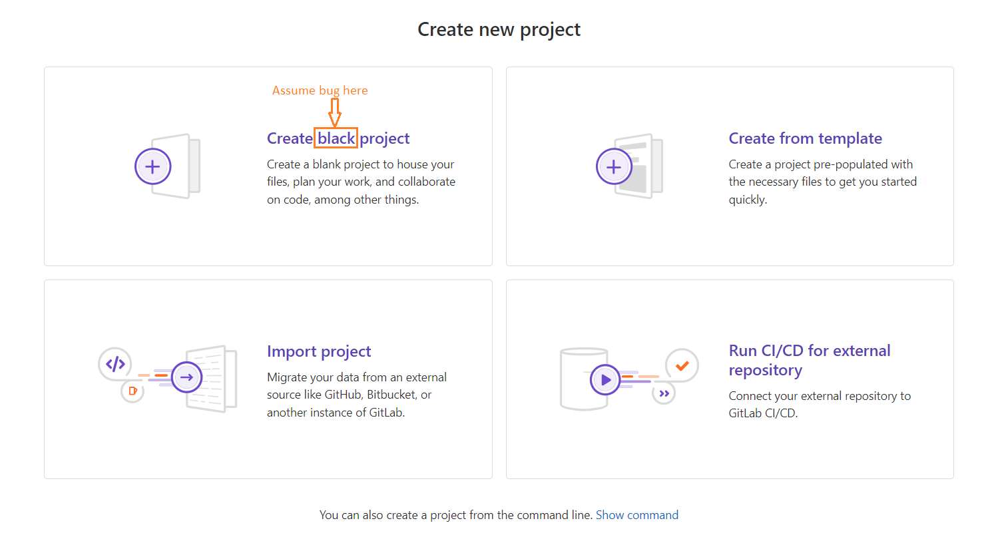

## Summary (Summarize the bug encountered concisely)

    The “Create blank project” button on the GitLab project creation page displays a typo. The word “blank” has been mistakenly written as “black”.

## Steps to reproduce     

    Navigate to the GitLab project creation page: https://gitlab.com/projects/new#blank_project

    Observe the button that should say “Create blank project”   

## What is the current bug behavior?

    The button displays the text “Create black project”.     

## What is the expected correct behavior?

    The button should display “Create blank project”.
     
## Relevant logs and/or screenshots

## Possible fixes

    Check the frontend label or localization file for a typo in the text string used in the “Create Project” page.  

## Whom do you report/ Assign To/ Tags

    /label ~bug ~reproduced ~needs-investigation  
    /cc @project-manager  
    /assign @qa-tester  

## Priority

    Minor – This is a UI typo and does not affect functionality, but it may confuse users.      